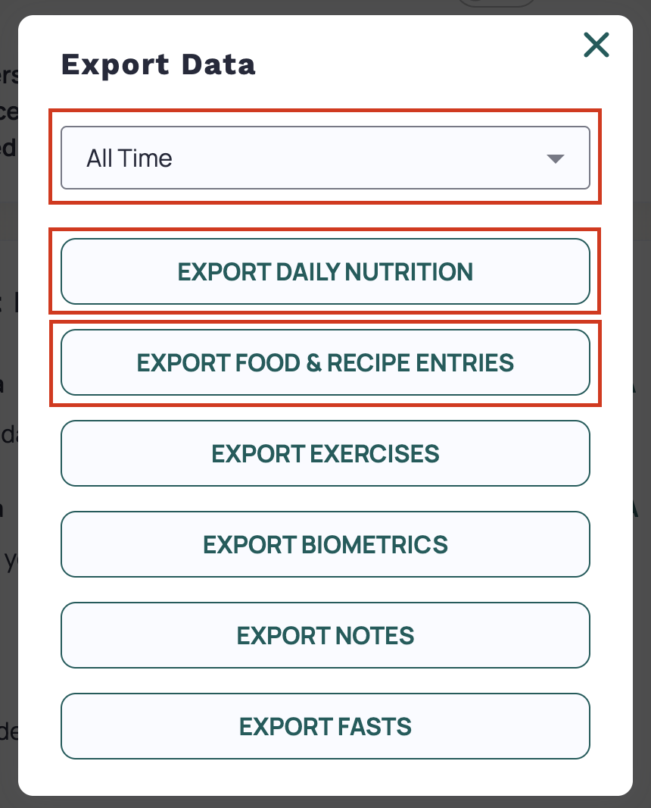
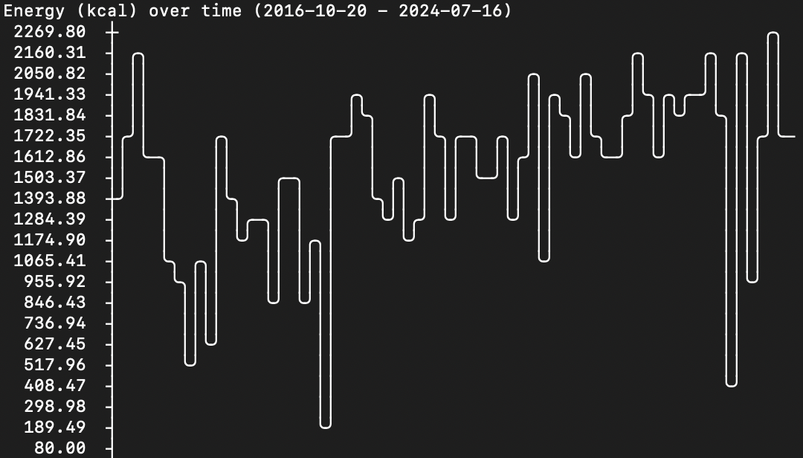

# Cronometer Analysis

CLI tool that provides an analysis of your Cronometer data.

## Setup

Clone the repo and install the project dependencies.
```bash
pip install -r requirements.txt
```

Next, export your nutrition data from Cronometer. You can do this by logging into [cronometer.com](https://www.cronometer.com), navigating to More > Account, and exporting your Daily Nutrition and Food & Recipe entires for the desired timeframe. 



If you've been logging for a while, you may not be able to export the Food & Recipe entires for all time, so you may have to settle for a year.

## Average micronutrients/day

Returns your average quantity of each tracked micronutrient (glorified average of all columns).

```bash
python3 cronometer.py get-average --summary path/to/dailysummary.csv
```

Optionally, set a time frame (`--since="2023-12-25"`) or exclude outlier days under or over certain calorie threshold (`--disregard-under=1000 --disregard-above=2600`). Additionally, you can disregard days that were not marked as "complete" (`--complete-only`).

```bash
python3 cronometer.py get-average --summary path/to/dailysummary.csv --disregard-under=1000 --disregard-above=2600 --complete-only
```

## Micronutrients over time

Returns a line graph displaying the daily micronutrient over time. Provide the micronutrient you wish to track with the `--track` argument.

```bash
python3 cronometer.py time --summary path/to/dailysummary.csv --track="Energy (kcal)"
```


